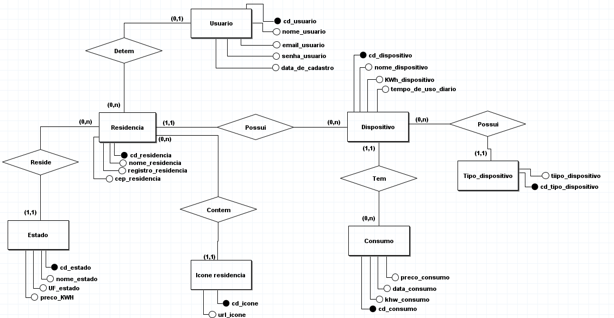

# Lumiere

## Diagrama de Classes

## Diagrama de Entidade e Relacionamento (DER)

## Diagrama Lógico 

## Protótipo de baixa fidelidade

## Protótipo de média fidelidade

## Protótipo de alta fidelidade

Usamos o [Figma](https://www.figma.com/file/kkWl8H2nABLwmHgCVIVU9s/Lumiere?type=design&node-id=882%3A11&mode=design&t=Ps82p84YvvP6Nt3p-1) para fazer o [prototipo](https://www.figma.com/proto/kkWl8H2nABLwmHgCVIVU9s/Lumiere?type=design&node-id=16-2&t=AZxNKnHIuwccQYoH-1&scaling=min-zoom&page-id=0%3A1&starting-point-node-id=16%3A2&mode=design) final.

## Tecnologias do projeto

O projeto foi desenvolvido com Java utilizando o framework Spring, aplicando a arquitetura MVC (Model-View-Controller). Quanto ao banco de dados, foi utilizado a linguagem SQL em conjunto com o Sistema Gerenciador de Banco de Dados Relacional SQL Server. O projeto em algumas páginas também conta com a utilização do Bootstrap 5, o qual foi necessário para agilizar o desenvolvimento.